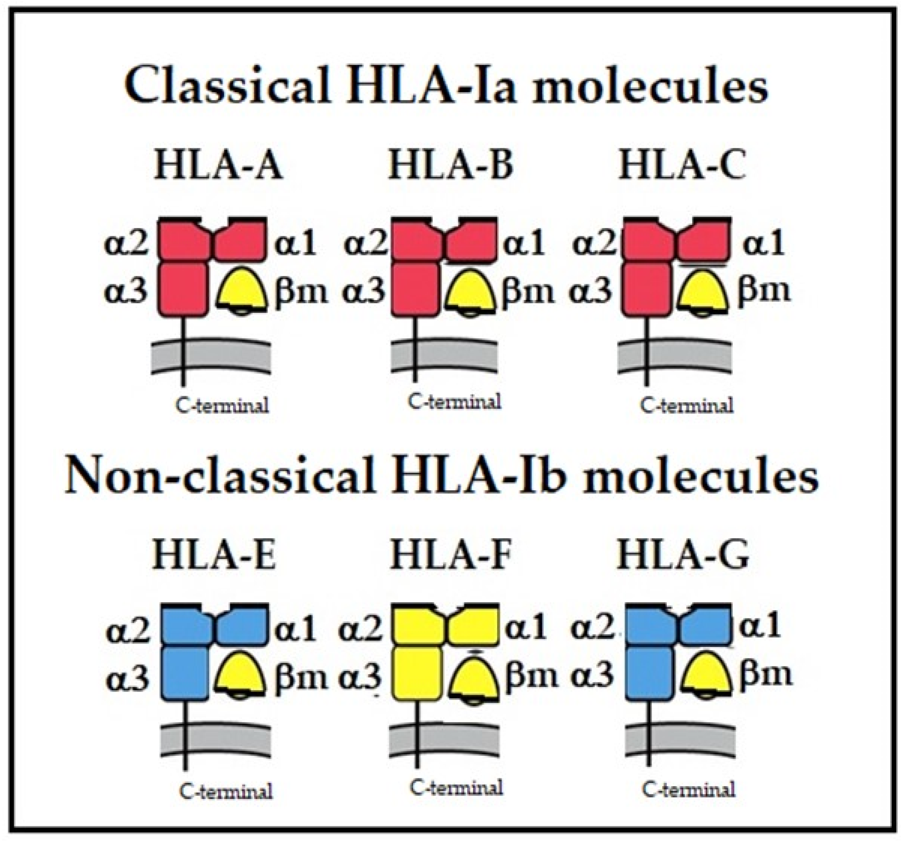
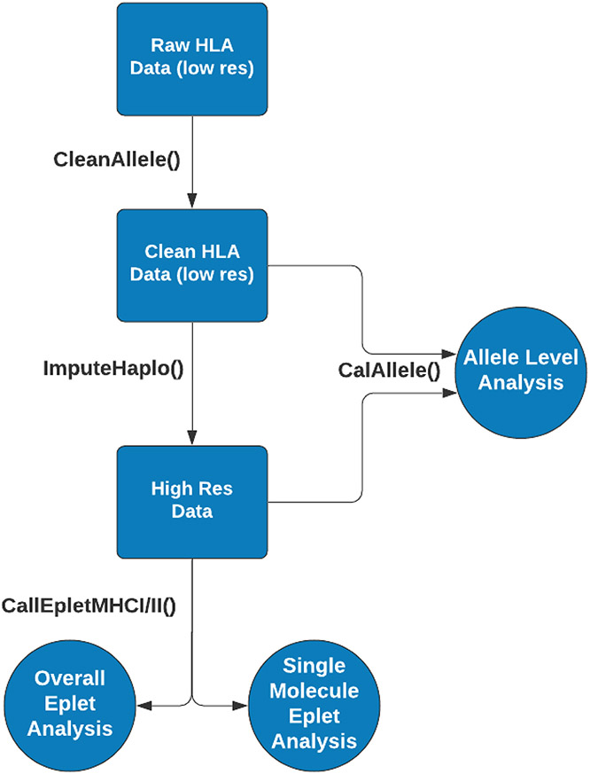

# Human leukocyte antigens tools in R (hlar)

HLA-typering, ook bekend als HLA-genotypering of HLA-typing, is een laboratoriumtechniek die wordt gebruikt om de genetische varianten van de menselijke leukocytenantigeen (HLA)-genen in een individu te identificeren. HLA-genen coderen voor eiwitten die zich op het celoppervlak bevinden en een cruciale rol spelen bij het immuunsysteem door het lichaam te helpen onderscheid te maken tussen eigen cellen en indringers zoals bacteriën en virussen.

## Het menselijke HLA-systeem

Is zeer polymorf, wat betekent dat er veel verschillende varianten (allelen) van HLA-genen zijn die tussen individuen kunnen verschillen. Deze genetische variabiliteit speelt een belangrijke rol bij het bepalen van de compatibiliteit van weefsels en organen voor transplantatie, evenals bij het risico op auto-immuunziekten, allergieën en andere immuungerelateerde aandoeningen.

HLA-typering omvat het identificeren van de specifieke allelen van HLA-klasse I-genen (HLA-A, HLA-B en HLA-C) en HLA-klasse II-genen (HLA-DR, HLA-DQ en HLA-DP) in een individu. Dit kan worden gedaan met behulp van verschillende laboratoriumtechnieken, waaronder moleculaire methoden zoals polymerasekettingreactie (PCR) gevolgd door sequentieanalyse, next-generation sequencing (NGS), en andere gespecialiseerde technieken.

HLA-typering is essentieel bij transplantatiegeneeskunde omdat een goede match tussen donor en ontvanger op HLA-allelen het risico op afstoting van getransplanteerde weefsels en organen vermindert. Het wordt ook gebruikt bij het onderzoek naar immuungerelateerde aandoeningen om te begrijpen hoe genetische variaties in het HLA-systeem het risico op ziekte beïnvloeden.

```{r}

```
Figure 1. Isotypes of human major histocompatibility proteins


## hlaR tools
Is een package met verschillende functies voor eplet-analyse van HLA (humaan leukocytenantigeen) mismatches tussen donor en ontvanger. 
De data die in dit opdracht wordt gebruikt is geiïmporteerd van Allele Frequency Net Database.

```{r}

```
Figer2: hlaR workflow


De dataset is geiïmporteerd van Allele Frequency Net Database Link:https://www.allelefrequencies.net/population.asp?pop_id=3327


## Data cleaning and allele level analysis
## CalAlleleMismFreq
De eerste stap om de hla analyse toe te passen is het inspecteren van de meest voorkomende allelen in de dataset van de patienten en de doners gevolgd door de evaluatie van HLA-mismatches op allelniveau binnen een populatie.
De input van CalAlleleMismFreq() functie is HLA-typeringen van verschillende dooners en ontvangers. 

Voor elk donor-ontvangerpaar identificeert de functie de niet-overeenkomende allelen, gerangschikt op basis van hun frequentie in de totale populatie zoals weergegeven in de invoerdataset


```{r, echo=FALSE}
library(hlaR)
```


```{r}
# Lees de recipient data in zonder headers
rcptDATA <- read.csv("doc/hla_bestanden/AFND0001243.csv", header = FALSE)

# Definieer de nieuwe kolomnamen
new_headers1 <- c("id", "recipient.a1", "recipient.a2", "recipient.b1", "recipient.b2", 
                 "recipient.c1", "recipient.c2", "recipient.drb11", "recipient.drb12")
#new_headers
colnames(rcptDATA) <- new_headers1
colnames(rcptDATA)

#  Lees de donor data in zonder headers
donorDATA <- read.csv("doc/hla_bestanden/AFND0003327.csv", header = FALSE)

#new_headers
new_headers2 <- c("id", "donor.a1", "donor.a2", "donor.b1", "donor.b2", 
                 "donor.c1", "donor.c2", "donor.drb11", "donor.drb12")

colnames(donorDATA) <- new_headers2
colnames(donorDATA)

 # Voeg de twee data samen op basis van de kolom id.
DATA <- merge(rcptDATA, donorDATA, by.x = "id", by.y = "id")
head(DATA)

```


Gebruik de functie CalAlleleMismFreq om de mismatch te evalueren op allelniveau tussen donor en ontvanger en presenteert vervolgens de meest voorkomende niet-overeenkomende allelen.


```{r}
# DATA

#allele A
don_a <- c("donor.a1", "donor.a2")
rcpt_a <- c("recipient.a1", "recipient.a2")
re_a <- CalAlleleMismFreq(dat_in = DATA, nms_don = don_a, nms_rcpt = rcpt_a)
head(re_a)

```
conclusie CalAlleleMismFreq:
Meest Voorkomende Allelen:

Het allel A*23:01 komt het meest voor met een frequentie van 37.
A*02:01 is het op een na meest voorkomende allel met een frequentie van 28.

Minder Voorkomende Allelen:

De allelen A*01:03 en A*68:02 hebben beide een frequentie van 11.
A*01:01 en A*74:01 hebben beide een frequentie van 10.Meest voorkomende allele in dit geval is A*23:01, met een frequentie van 37.


## CalAlleleTopN topN meest voorkomende HLA-allelen
## CalAlleleMismFreq

Voer opgeschoonde HLA-gegevens (Human Leukocyte Antigen) in voor een populatie transplantatiedonoren en ontvangers om de meest voorkomende allelen in de populatie te bepalen.

```{r}
#CalAlleleTopN topN most frequent HLA alleles
don_b <- c("donor.a1", "donor.a2")
rcpt_b <- c("recipient.a1", "recipient.a2")
re_b <- CalAlleleTopN(dat_in = DATA, nms_don = don_b, nms_rcpt = rcpt_b, top_n = 5)
head(re_b)
```
conclusie CalAlleleTopNDi:

De meest voorkomende allelen en hun frequenties onder donoren (don) zijn:
Allel 2 met frequentie 15
Allel 29 met frequentie 5
Allel 11 met frequentie 4
Allel 3 met frequentie 3
Allel 25 en allel 68 beide met frequentie 2

Frequenties voor Ontvangers:
De meest voorkomende allelen en hun frequenties onder ontvangers (rcpt) zijn:
Allel 2 met frequentie 17
Allel 1 met frequentie 6
Allel 32 met frequentie 5
Allel 24 met frequentie 4

Vergelijking tussen Donoren en Ontvangers:
Het allel 2 is het meest voorkomend bij zowel donoren als ontvangers, hoewel de frequentie hoger is bij ontvangers (17) dan bij donoren (15).
De allelen en hun frequenties verschillen verder tussen donoren en ontvangers, wat wijst op verschillen in de genetische samenstelling tussen deze twee groepen.


## Calculate class I HLA eplet mismatch
## CalEpletMHCI 
Deze functie is ontworpen te om eplet-mismatches te berekenen voor MHC-I (Major Histocompatibility Complex Class I) moleculen. Eplets zijn specifieke aminozuursequenties op HLA-moleculen die een rol spelen in de herkenning door het immuunsysteem. Het identificeren van mismatches in eplets tussen donoren en ontvangers is cruciaal voor transplantatie-compatibiliteit, omdat mismatches kunnen leiden tot afstoting van het getransplanteerde orgaan.

```{r}
library(readr)
MHC_I_eplet_v3 <- read_csv("doc/hla_bestanden/MHC_I_eplet_v3.csv")

head(MHC_I_eplet_v3)

dat_MHC1 <-read.csv("doc/hla_bestanden/MHC_I_test.csv")

re_MHC1 <- CalEpletMHCI(dat_in = dat_MHC1, ver = 3)

head(re_MHC1)

```
conclusie CalEpletMHCI:
subject: De naam of code van het individu waarop de eplets zijn berekend.
mm_cnt_tt: Het totale aantal berekende eplets (mismatches) voor het individu.
mm_cnt_uniq: Het aantal unieke eplets (unieke mismatches) voor het individu.

Deze output geeft inzicht in de genetische variabiliteit binnen een populatie of dataset, specifiek gerelateerd aan de eplets van het major histocompatibility complex class I (MHCI). Hier zijn enkele mogelijke conclusies die uit deze gegevens kunnen worden getrokken:

Genetische diversiteit: Individuen vertonen verschillende aantallen totale eplets (mm_cnt_tt) en unieke eplets (mm_cnt_uniq), wat wijst op variabiliteit in de genetische samenstelling van het MHCI.

Immunologische relevantie: De aanwezigheid van unieke eplets suggereert dat elk individu mogelijk verschillende antigenen kan presenteren aan het immuunsysteem, wat belangrijk kan zijn voor immunologische processen zoals immuunresponsen en auto-immuunziekten.

Klinische implicaties: Voor klinische toepassingen, zoals orgaantransplantaties of het ontwerpen van vaccins, kan het begrijpen van de diversiteit en unieke eplets van belang zijn. Dit kan helpen bij het matchen van donor-ontvangerparen of het ontwikkelen van gepersonaliseerde therapieën.

Onderzoekspotentieel: De dataset kan dienen als basis voor verdere analyse naar correlaties tussen genetische variabiliteit, epletprofielen en klinische uitkomsten, wat nieuwe inzichten kan bieden in immunogenetica.


```{r echo=FALSE, eval=FALSE, include=FALSE}

library(dplyr)
library(tidyr)

# Data importeren
DATA_MHCI <-  read.csv("doc/hla_bestanden/AFND0003327.csv", header = FALSE)

head(DATA_MHCI)


# Selecteer de eerste 24 rijen
# selected_DATA_MHCI <- DATA_MHCI %>% slice(1:24)

new_headers_mhci <- c("pair_id",	"a1",	"a2",	"b1",	"b2",	"c1",	"c2")

#new_headers
colnames(DATA_MHCI) <- new_headers_mhci

# Selecteer specifieke kolommen
selected_columns <- DATA_MHCI[, c("pair_id", "a1", "a2", "b1", "b2", "c1", "c2")]


head(selected_columns)

# Voeg de kolom 'subject_type' toe
subject_types <- rep(c("recipient", "donor"), 72) # 12 keer 'recipient', 'donor' patroon

DATA_MHCI_2 <- selected_columns %>% mutate(subject_type = subject_types)

# Bekijk de resulterende data frame

head(DATA_MHCI_2)

reMHCI <- CalEpletMHCI(dat_in = DATA_MHCI_2, ver = 3) 


#Voor HLA_A, HLA_B, HLA_C afzonderlijk
allele_freq_HLA_A1 <- DATA_MHCI_2 %>%
  count(a1) %>%
  arrange(desc(n))

allele_freq_HLA_A2 <- DATA_MHCI_2 %>%
  count(a2) %>%
  arrange(desc(n))

allele_freq_HLA_B1 <- DATA_MHCI_2 %>%
  count(b1) %>%
  arrange(desc(n))

allele_freq_HLA_B2 <- DATA_MHCI_2 %>%
  count(b2) %>%
  arrange(desc(n))

allele_freq_HLA_C1 <- DATA_MHCI_2 %>%
  count(c1) %>%
  arrange(desc(n))

allele_freq_HLA_C2 <- DATA_MHCI_2 %>%
  count(c2) %>%
  arrange(desc(n))


# Samenvoegen van de objecten
allele_freq_combined <- bind_rows(
  allele_freq_HLA_A1 %>% mutate(Locus = "HLA_A"),
  allele_freq_HLA_A2 %>% mutate(Locus = "HLA_A"),
  allele_freq_HLA_B1 %>% mutate(Locus = "HLA_B"),
  allele_freq_HLA_B2 %>% mutate(Locus = "HLA_B"),
  allele_freq_HLA_C1 %>% mutate(Locus = "HLA_C"),
  allele_freq_HLA_C2 %>% mutate(Locus = "HLA_C"))


# Stap 1: Verwijder rijen met ontbrekende gegevens indien nodig
allele_freq_combined <- allele_freq_combined %>%
  filter(complete.cases(.))

# Stap 2: Voer de functie CalEpletMHCI uit
result_cal_eplet <- CalEpletMHCI(dat_in = allele_freq_combined, ver = 2)

allele_freq_combined <- allele_freq_combined %>%
  arrange(Locus, desc(Count_HLA_X))  # Vervang X door A1, A2, B1, B2, C1, C2 afhankelijk van de kolomnaam

# Bekijk het resultaat
print(allele_freq_combined)


# Weergave van de samengevoegde frequentietabel
print(allele_freq_combined)


# Controleer op ontbrekende waarden in de dataset
summary(DATA_MHCI_2)

# Of gebruik colSums(is.na(DATA_MHCI_2)) om het aantal ontbrekende waarden per kolom te bekijken
missing_values <- colSums(is.na(DATA_MHCI_2))

# Toon het aantal ontbrekende waarden per kolom
print(missing_values)

# Beslis hoe je wilt omgaan met ontbrekende waarden
# Bijvoorbeeld, als je ontbrekende waarden wilt verwijderen uit de dataset:
# Vervang ontbrekende waarden door NA
DATA_MHCI_2_clean <- na.omit(DATA_MHCI_2)

# Of vervang ontbrekende waarden door een andere waarde, bijvoorbeeld door middel van imputatie
# Hieronder een voorbeeld met mean imputatie voor numerieke kolommen:
# Vervang NA's in numerieke kolommen door de gemiddelde waarde van die kolom
numeric_cols <- sapply(DATA_MHCI_2, is.numeric)
DATA_MHCI_2_imputed <- DATA_MHCI_2
for (col in which(numeric_cols)) {
  DATA_MHCI_2_imputed[is.na(DATA_MHCI_2_imputed[, col]), col] <- mean(DATA_MHCI_2_imputed[, col], na.rm = TRUE)
}

# Bekijk de samenvatting van de geïmputeerde dataset
summary(DATA_MHCI_2_imputed)


reMHCI <- CalEpletMHCI(dat_in = allele_freq_combined, ver = 2) 


```


## Calculate class II HLA eplet mismatch
## CalEpletMHCII
Deze functie wordt toegepast om eptlet-mismatches te berekenen op basis van MHC-II (Major Histocompatibility Complex Class II) gegevens. MHC-II moleculen spelen een cruciale rol bij de presentatie van antigenen aan CD4+ T-cellen in het immuunsysteem.

```{r}

### CalEpletMHCII
MHC_II_eplet_v3 <- read.csv("doc/hla_bestanden/MHC_II_eplet_B_v3.csv")

dat_MHCII <-read.csv("doc/hla_bestanden/MHC_II_test.csv")


re_MHCII <- CalEpletMHCII(dat_in = dat_MHCII, ver = 3)

head(re_MHCII)


```

DQ: Aantal eptlet-mismatches voor het HLA-DQ locus tussen de donor en ontvanger.
DR: Aantal eptlet-mismatches voor het HLA-DR locus tussen de donor en ontvanger.
risk: Het risiconiveau dat wordt geassocieerd met de mate van eptlet-mismatches tussen de donor en de ontvanger.
De kolommen DQ en DR geven respectievelijk het aantal eptlet-mismatches weer voor de HLA-DQ en HLA-DR loci tussen de donor en de ontvanger. Het veld risk geeft aan welk risiconiveau wordt toegewezen aan het paar op basis van deze eptlet-mismatches.

Het aantal eptlet-mismatches tussen donor en ontvanger kan helpen bij het voorspellen van de kans op afstoting na een transplantatie.

Paar van HLA-allelen met pair_id nummer 103 heeft het grootste aantal eptlet-mismatches tussen donor en ontvanger dit betekent dat de kans op afstoting na een transplantatie groot is.


## HLA-allelen normaliseren
## CleanAllele
Deze functie gebruikt ruwe, rommelige HLA-typegegevens (Human Leukocyte Antigen) als invoer. Het verwijdert inconsistente opmaak en onnodige symbolen. Als een van de twee allelen op een loci NA is, wordt aangenomen dat de locus homozygoot is

```{r}
### CleanAllele 

re_CleanAllele <- CleanAllele(DATA$recipient.b1, DATA$recipient.b2)
head(re_CleanAllele)
``` 
Conclusie_ CleanAllele:
var_1 en var_2: Dit zijn karaktervariabelen die waarschijnlijk verschillende identificaties of kenmerken vertegenwoordigen. In de context van HLA-allelen zouden var_1 en var_2 de specifieke allelen kunnen aanduiden die worden vergeleken of geanalyseerd.

locus1_clean en locus2_clean: Dit zijn schoongemaakte versies van de HLA-allelen uit var_1 en var_2, waarbij eventuele overbodige informatie zoals spaties of onnodige notaties zijn verwijderd. Ze vertegenwoordigen respectievelijk de gestandaardiseerde notaties van het eerste en het tweede HLA-allel.
ar_1 en var_2: De oorspronkelijke HLA-allelen zoals gepresenteerd in de invoer.
locus1_clean en locus2_clean: De gestandaardiseerde notaties van de HLA-allelen na het schoonmaken van onnodige informatie.
AlleleMismCount: Het aantal mismatches tussen de HLA-alleelparen var_1 en var_2.
De functie lijkt mismatches te tellen op basis van de gestandaardiseerde notaties van HLA-allelen. In dit geval is het aantal mismatches altijd 2, wat aangeeft dat er twee verschillen zijn tussen elk paar HLA-allelen (bijv. 18:01 versus 40:01)

## Evaluate mismatched alleles
##  EvalAlleleMism
Deze functie evalueert het aantal HLA-allel-mismatches tussen donors en ontvangers. De precieze werking hangt af van de implementatie van deze functie in de gebruikte R-pakketten of scripts. Hoewel ik de exacte code niet heb, kan ik een algemeen idee geven van hoe dergelijke functies meestal werken en hoe je de resulterende gegevens kunt gebruiken.

```{r}

### EvalAlleleMism

# Mismatch bij een homozygoot allel 
re_EvalAlleleMism1<- EvalAlleleMism(DATA$donor.c1, DATA$donor.c2, DATA$recipient.c1, DATA$recipient.c2, hmz_cnt = 1)

head(re_EvalAlleleMism1)

# Stel hmz_cnt = 2 om homozygote mismatches als dubbel te tellen.(allellen c1, c2)
re_EvalAlleleMism_c <- EvalAlleleMism(DATA$donor.c1, DATA$donor.c2, DATA$recipient.c1, DATA$recipient.c2, hmz_cnt = 2)
head(re_EvalAlleleMism_c)

# kies mismach c
library(dplyr)
re_EvalAlleleMism_c <- rename(re_EvalAlleleMism_c, mism.c = mism_cnt)

# Stel hmz_cnt = 2 om homozygote mismatches als dubbel te tellen.(allelen drb11, drb12)
re_EvalAlleleMism_drb <- EvalAlleleMism(DATA$donor.drb11, DATA$donor.drb12, DATA$recipient.drb11, DATA$recipient.drb12, hmz_cnt = 2)
head(re_EvalAlleleMism_drb)

# kies mismach drb
re_EvalAlleleMism_drb <- rename(re_EvalAlleleMism_drb, mism.drb = mism_cnt)

# Stel hmz_cnt = 2 om homozygote mismatches als dubbel te tellen.(allelen a1, a2)
re_EvalAlleleMism_a <- EvalAlleleMism(DATA$donor.a1, DATA$donor.a2, DATA$recipient.a1, DATA$recipient.a2, hmz_cnt = 2)
head(re_EvalAlleleMism_a)

# kies mismach a
re_EvalAlleleMism_a <- rename(re_EvalAlleleMism_a, mism.a = mism_cnt)

# Stel hmz_cnt = 2 om homozygote mismatches als dubbel te tellen.(allelen b1,b2)
re_EvalAlleleMism_b <- EvalAlleleMism(DATA$donor.b1, DATA$donor.b2, DATA$recipient.b1, DATA$recipient.b2, hmz_cnt = 2)
head(re_EvalAlleleMism_b)

# kies mismach b
re_EvalAlleleMism_b <- rename(re_EvalAlleleMism_b, mism.b = mism_cnt)

# voeg de mismaches
HLA_MisMatch_count <- c(re_EvalAlleleMism_a$mism.a, re_EvalAlleleMism_b$mism.b, re_EvalAlleleMism_c$mism.c, re_EvalAlleleMism_drb$mism.drb)

# Matrix maken van de mismatch-gegevens. Hier geef ik ncol=4 aan omdat we vier kolommen hebben.
HLA_MisMatch_count <- matrix(c(re_EvalAlleleMism_a$mism.a, re_EvalAlleleMism_b$mism.b, 
                               re_EvalAlleleMism_c$mism.c, re_EvalAlleleMism_drb$mism.drb), 
                             ncol=4, byrow=FALSE)

# De matrix omzetten naar een data frame (optioneel)
df_HLA_MisMatch_count <- as.data.frame(HLA_MisMatch_count)

# Kolomnamen instellen
colnames(df_HLA_MisMatch_count) <- c("mism.a", "mism.b", "mism.c", "mism.drb")

# Resultaat bekijken
head(df_HLA_MisMatch_count)


```
mism_cnt = 1: Aantal mismatches tussen dit donor-ontvanger paar.

Deze output kan worden gebruikt om te beoordelen hoe compatibel donoren en ontvangers zijn op basis van HLA-allel-identiteit en -mismatches, wat cruciale informatie is in transplantatiegeneeskunde om afstoting te minimaliseren en het succes van transplantaties te verbeteren.


## Count HLA mismatch at the allele level
## CountAlleleMism
Is ontworpen om het aantal allel-mismatches tussen twee sets van HLA-allelen te tellen. 

```{r}
### CountAlleleMism 

classI <- CountAlleleMism(df_HLA_MisMatch_count, c("mism.a", "mism.b"))

classII <- CountAlleleMism(df_HLA_MisMatch_count, c("mism.c", "mism.drb"))

head(classI)
head(classII)
```

## ImputeHaplo
Wijs HLA-typering (Human Leukocyte Antigen) met lage of gemengde resolutie toe aan de meest waarschijnlijke hoge resolutie gelijkwaardig. Imputatie is rekenintensief, dus grote datasets kunnen vertragingen oplopen bij de verwerking. Deze functie maakt gebruik van gegevens van het NMDP (National Marrow Donor Program), en
is momenteel beperkt tot HLA A-, B-, C- en DRB-loci.
```{r, message=FALSE, error=FALSE}
### ImputeHaplo 
dat_imput <- read.csv("doc/hla_bestanden/Haplotype_test.csv")
colnames(dat_imput)

# Nu ImputeHaplo functie toepassen
result <- ImputeHaplo(dat_in = dat_imput)
head(result)

```


 


 


 


