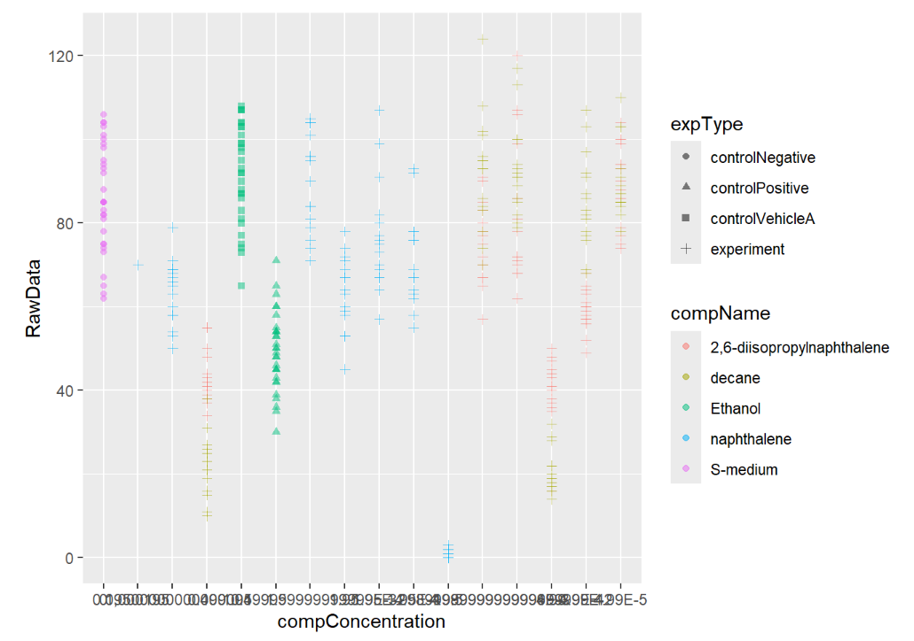
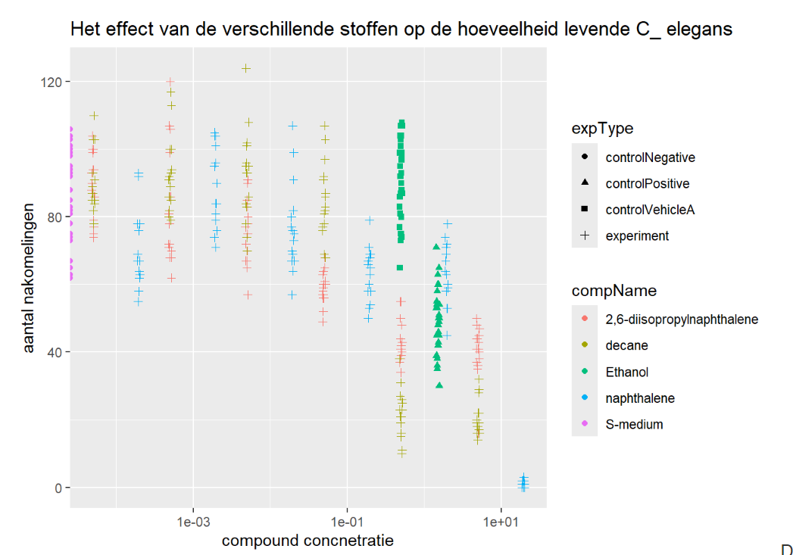

# Data analyse afgeleid van een experiment op volwassen C.elegans nematoden
In dit experiment werden de volwassen C.elegans nematoden blootgesteld aan variërende concentraties van verschillende verbindingen. Het doel van de data en gegevens analyse is het uitvoeren van een dosis-responsanalyse met behulp van een log-logistisch model met schattingen voor het maximale, het minimale, de IC50-concentratie en de helling bij IC50.

```{r, include=FALSE}
knitr::opts_chunk$set(echo = TRUE, warning = FALSE, message = FALSE)
```


```{r, Packages, message=FALSE}
# Benodigde packages voor dit data analyse opdracht
library(RColorBrewer)
library(reactable)
library(here)
library(tidyverse)
library(readxl)
library(DT)
library(ggplot2)
library(dplyr)
library(scales)
```


## Bestand van de ruwe data importeren en inspecteren
```{r}
# Lees het Excel-bestand in
c_elegans_data <- readxl::read_excel(here::here("CE.LIQ.FLOW.062_Tidydata.xlsx"))
# Data inspectie 
head(c_elegans_data)
# De data laden in dataframe
head(data.frame(c_elegans_data))
```
##  De data visualiseren in een spreidingsdiagram met ggplot2

```{r}
ggplot(data = c_elegans_data,
       aes(x = compConcentration,
           y = RawData)) +
  geom_point(aes(color = compName, shape = expType),
             size = 1.5, alpha = 0.5) +
  labs(labs(title = "Het effect van de verschillende stoffen op de hoeveelheid levende C_ elegans",
         x = "compound concnetratie", 
       y = "aantal nakomelingen" ))
```


De compConcentration variable is als character datat bestand, daarom is het handig voor de data visualisatie om naar numeric te veranderen.

```{r, warning=FALSE, message=FALSE}
# componCentration van character naar numeric variable

c_elegans_data$compConcentration <- as.numeric(c_elegans_data$compConcentration)

# De plot leesbaarder maken door de data te normaliseren door de Log10 van compConcentrion te nemen en geom_jitter toevoegen.

install.packages("scales")
library(scales)
library(tidyverse)

c_elegans_data_grafiek <- 
  as_tibble(c_elegans_data) %>%
  ggplot(aes(x = compConcentration,
             y = RawData,
             shape = expType,
             colour = compName)) +
  geom_point(position = position_jitter(w = 0.02, h = 0)) + 
  scale_x_continuous(trans = log10_trans()) + 
  labs(title = "Het effect van de verschillende stoffen op de hoeveelheid levende C_ elegans",
         x = "compound concnetratie", 
       y = "aantal nakomelingen" )
print(c_elegans_data_grafiek)

```


De positieve controle voor dit experiment iEthanol. De negatieve controle voor dit experiment is S-medium.

Om erachter te komen of er inderdaad een effect is van verschillende concentraties op het aantal nakomelingen en of de verschillende verbindingen een verschillende curve hebben (IC50) kan de volgende stappenplan uitvoeren:

1- Data downloaden en tidy maken en het verzamelen van de concentraties van de compounds en het aantal nakomelingen voor elk monster onder elke concentratie.

2- Normaliteit checken met Shapio-Wilk test.

3- De data plotten.

4- Lineaire regressie: om te onderzoeken of er een lineair verband is tussen de concentraties van de verbindingen en het aantal nakomelingen.

2- ANOVA: om twee groepen te vergelijken bijvoorbeeld verschillende concentraties van verschillende verbindingen en voor het testen of er een significant verschil is tussen de gemiddelde aantallen nakomelingen kan ANOVA uitvoeren.

3- Estimatie van IC50-waarden:
Voor het schatten van IC50-waarden kan een dosis-responsmodel passen, zoals een logistische regressie.Pas een logistisch regressiemodel toe ogistic_model <- glm(response ~ concentratie, family = binomial, data = dataset)
Bereken de IC50-waarde
IC50_value <- predict(logistic_model, type = "response", newdata = data.frame(concentratie = 50))

```{r dAta normaliseren en plotten, warning=FALSE, message=FALSE}
# Negatieve controle filteren
data_negatieve_controle <- c_elegans_data %>% filter(c_elegans_data$expType == "controlNegative")

# Negative controle mean
gem_N_control <- mean(data_negatieve_controle$RawData, na.rm = TRUE)

# summary
summary_c_elegans <- c_elegans_data %>% group_by(expType, compName, compConcentration) %>% summarize(mean = mean(RawData, na.rm = TRUE))

# kolom van de genormalizeerde data toevoegen
data_normalizeren <- summary_c_elegans %>%
  mutate(RawData_normalized = mean / gem_N_control)

# Plotten
ggplot(data = data_normalizeren, aes(x = log10(compConcentration), y = RawData_normalized)) +
  geom_jitter(aes(color = compName, shape = compName),width = 0.09)+
  labs(title = "Gemiddelde aantal nakomelingen per compound concentratie",
       subtitle = "De concentratie is genormaliseerd door de negatieve controle",
        x = "log10  compound Concentratie",
       y = "Gemiddelde aantal nakomelingen"
      )
```

