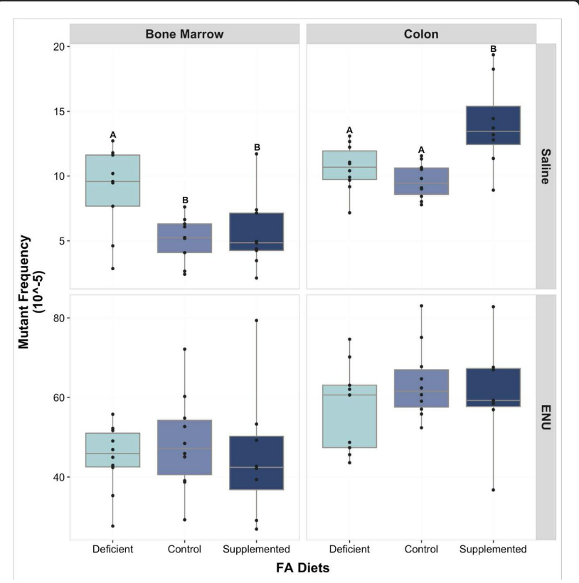

#  Identifying reproducibility
## Voor dit opdracht wordt er een artikel gekozen van SPANDIDOS PUBLICATIONS website.

Reproduceerbaarheid houdt in dat onderzoeksgegevens en code openbaar worden gemaakt, waardoor anderen dezelfde resultaten kunnen behalen als die worden gerapporteerd in wetenschappelijke publicaties. Gerelateerd hieraan is het begrip repliceerbaarheid, wat inhoudt dat wetenschappelijke methoden worden herhaald om vergelijkbare conclusies te verkrijgen.


In dit review wordt de reproduceerbaarheid geidentificeerd van een wetenschappelijke onderzoek die op BioRxiv online platform wordt gepubliceerd.
[link naar het artikel](https://www.biorxiv.org/content/10.1101/2020.07.27.223552v1.full)

Om de reproduceerbaarheid van artikel "Mutagenicity of folic acid deficiency and supplementation is tissue-specific and results in distinct mutation profiles" te evalueren worden er specifieke criteria gebruikt onder andere, het doel van de studie, de beschikbaarheid van de data. 

### Reference voor het artikel:
Mutagenicity of folic acid deficiency and supplementation is tissue-specific and results in distinct mutation profiles. (z.d.). Geraadpleegd op 30 april 2024, van https://www.biorxiv.org/content/10.1101/2020.07.27.223552v1.full

### De criteria voor reproduciblity 
| Transparency Criteria| Definition       | Response Type|
|---------|-------------------------------|----------|
|Study Purpose |A concise statement in the introduction of the article, often in the last paragraph, that establishes the reason the research was conducted. Also called the study objective.| Existing| 
|Data Availability Statement | A statement, in an individual section offset from the main body of text, that explains how or if one can access a study’s data. The title of the section may vary, but it must explicitly mention data; it is therefore distinct from a supplementary materials section.| existing|
|Data Location | Where the article’s data can be accessed, either raw or processed.| NCBI Sequence Read Archive.|
|Study Location| Author has stated in the methods section where the study took place or the data’s country/region of origin.| Canada|
|Author Review| The professionalism of the contact information that the author has provided in the manuscript.|Yes,Author contributions|
|Ethics Statement | A statement within the manuscript indicating any ethical concerns, including the presence of sensitive data.|existing|
|Funding Statement| A statement within the manuscript indicating whether or not the authors received funding for their research.|Not existing|
Code Availability | Authors have shared access to the most updated code that they used in their study, including code used for analysis. |Not existing|


### Overview
Doel
het doel van het onderzoek waarop dit artikel gebaseerd is de associatie tussen folaatdeficiëntie met een verhoogd risico op colorectale kanker (CRC) en acute lymfatische leukemie, terwijl een hoge inname van foliumzuur (FA) juist wordt gekoppeld aan een hoger risico op CRC.

Methode
Het mutagene potentieel van FA-inname in verschillende weefsels is echter nog niet grondig onderzocht. In dit onderzoek worden de mutaties geanalyseerd in folaatgevoelige somatische weefsels, zoals het beenmerg en de dikke darm, van dezelfde MutaMouse-muizen. Vervolgens wordt  FA-geïnduceerde mutatieprofielen van beide weefsels bepaald door middel van next generation sequencing.


Resultaten
Een tekort aan FA verhoogde de frequentie van mutanten in het beenmerg, terwijl supplementation met foliumzuur de frequentie van mutanten in de dikke darm verhoogde. Analyse van de mutatieprofielen suggereerde dat FA interageerde met mutagene mechanismen die uniek zijn voor elk weefsel. Deze gegevens werpen licht op potentiële mechanismen die verschillen in gevoeligheid voor FA-gerelateerde kankers kunnen verklaren.

```{r, echo=FALSE}

```
Figuur1: Bone marrow and colon folic acid (FA)-induced lacZ MF


