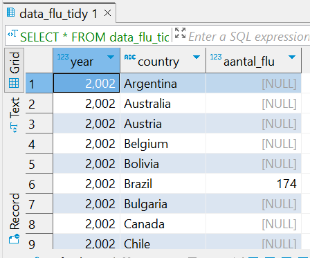
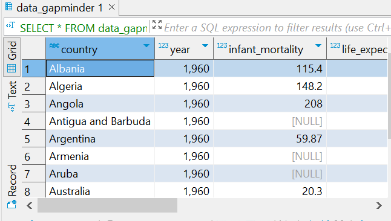
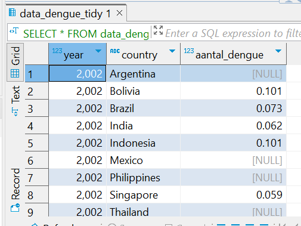
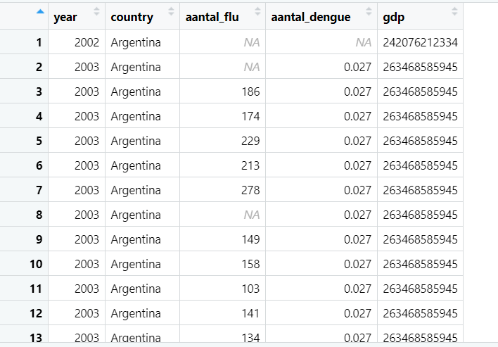
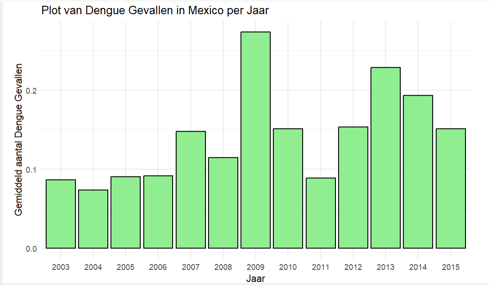
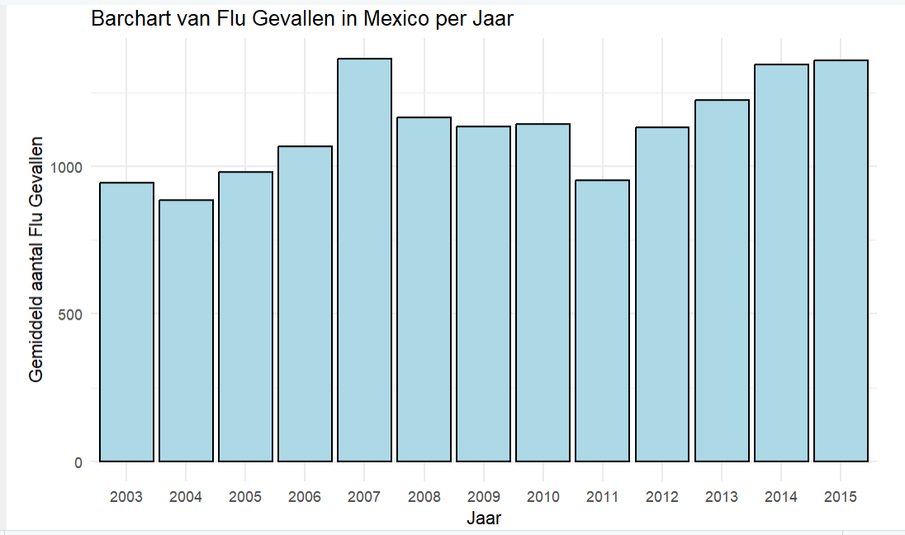

# Dit opdracht wordt de Structured Query Language - or SQL programmeertaal gebruikt voor het beheren van relationele databases.

Met SQL wordt verschillende bewerkingen op de flu and dengue data uitgevoerd, zoals het maken en wijzigen van databasestructuren zoals tabellen toevoegen en het manipuleren van gegevens binnen die structuren.


```{r, libraries, error=FALSE, message=FALSE}
library(tidyverse)
library(readxl)
library(dslabs)
library(stringr)
library(data.table)
library(tidyverse)
library(here)
library(dslabs)
library(grid)
library(readr)
library(RPostgreSQL)
library(gridExtra)
library(ggpubr)
library(stringr)
library(png)
library(DT)
library(ggplot2)

```

## Data laden

```{r}
#The flu, the dengue en gapminder packages loaden

##flu data
data_flu <- read_csv("https://raw.githubusercontent.com/DataScienceILC/tlsc-dsfb26v-20_workflows/main/data/flu_data.csv", skip = 10)

head(data_flu)

##dengue data
data_dengue <- read_csv("https://raw.githubusercontent.com/DataScienceILC/tlsc-dsfb26v-20_workflows/main/data/dengue_data.csv", skip = 10)

head(data_dengue)

##gapminder data
data_gapminder <- gapminder
head(gapminder)

```
## Data Tidy maken
```{r}
## De flu data tidy maken
data_flu_tidy <- data_flu %>% pivot_longer(cols = -Date, names_to = "country", values_to = "aantal_flu")

head(data_flu_tidy)

## De Date vriable vervangen door de year

data_flu_tidy$Date <- str_sub(data_flu_tidy$Date, start = 1, end = 4)
data_flu_tidy <- rename(data_flu_tidy, year = Date)
data_flu_tidy$country <- as.factor(data_flu_tidy$country)
data_flu_tidy$year <- as.integer(data_flu_tidy$year)

head(data_flu_tidy)

## De dengue data tidy maken
data_dengue_tidy <- data_dengue %>% pivot_longer(cols = -Date, names_to = "country", values_to = "aantal_dengue")

head(data_dengue_tidy)

## De Date vriable in dengue vervangen door de year
data_dengue_tidy$Date <- str_sub(data_dengue_tidy$Date, start = 1, end = 4)
data_dengue_tidy <- rename(data_dengue_tidy, year = Date)
data_dengue_tidy$year <- as.integer(data_dengue_tidy$year)
data_dengue_tidy$country <- as.factor(data_dengue_tidy$country)

head(data_dengue_tidy)

```

```{r, data opslaan}
## De flu data opslaan
write.csv(data_flu_tidy, "data_flu_tidy.csv", row.names = FALSE)

saveRDS(data_flu_tidy, "data_flu_tidy.rds")

## De dengue data opslaan

write.csv(data_dengue_tidy, "data_dengue_tidy.csv", row.names = FALSE)
saveRDS(data_dengue_tidy, "data_dengue_tidy.rds")


## Gapminder data opslaan
write.csv(data_gapminder, "data_gapminder.csv", row.names = FALSE)
saveRDS(data_gapminder, "data_gapminder.rds")

```

## Een  nieuwe PostgreSQL database maken onder de naam “workflowsdb” in Dbeaver
Hier moet de gebruiker zijn eigen gegevens invullen

```{r, eval=FALSE, error=FALSE, message=FALSE}

# De link naar het exporteren van bestanden naar DBeaver vereist het invullen van persoonlijke gegevens, zoals een wachtwoord, dat uniek is voor alle gebruikers.
install.packages('RPostgreSQL')
#install.packages('devtools') # you should have this one already
install.packages('remotes')
install.packages('RPostgres')
library(DBI)
con <- dbConnect(RPostgres::Postgres(),
                 dbname = "workflowsdb",
                 host = "localhost",
                 port = "5432",
                 user = "postgres",
                 password = "******")
dbWriteTable(con, "data_flu_tidy", data_flu_tidy)
dbWriteTable(con, "data_dengue_tidy", data_dengue_tidy)
dbWriteTable(con, "data_gapminder", data_gapminder)

dbListTables(con)

```
## SQL script
----------------------------------------------------------------
-- Inspecteer de inhoud van de data_flu_tidy tabel
SELECT * FROM data_flu_tidy LIMIT 10;

-- Inspecteer de inhoud van de data_dengue_tidy tabel
SELECT * FROM data_dengue_tidy LIMIT 10;

-- Inspecteer de inhoud van de data_gapminder tabel
SELECT * FROM data_gapminder LIMIT 10;
----------------------------------------------------------------
## Data inspectie in Dbeaver


  
## Data inspectie in R

```{r, include=TRUE, message = FALSE, echo = FALSE}
# contents of the tables with dplyr (in R)
library(dplyr)
dplyr::as_tibble(data_dengue_tidy)

dplyr::as_tibble(data_flu_tidy)

dplyr::as_tibble(data_gapminder)
```
## samenvoegen van gapminder, flu en dengue data

```{r samengevoegde_data,  warning=FALSE, message=FALSE, eval=FALSE}

# Tabellen samenvoegen op de variable Years
new_gapminder <- data_gapminder[between(data_gapminder$year, 2002, 2015), ] 

# De dataframe hetzelfde maken als de data van flu en dengue
new_gapminder <- new_gapminder %>% select(year, country, infant_mortality:region) 

```

## De data exporteren naar Dbeaver
```{r, eval=FALSE, echo=FALSE, warning=FALSE, message=FALSE}
# De exported data moet in de juiste tabel komen
dbWriteTable(con, "new_gapminder", data_gapminder) 
```


Joining Gapminder, Flu, and Dengue Data
```{r, error=FALSE, eval=FALSE}
# Perform SQL join
# Reconnect to the database
con <- dbConnect(RPostgres::Postgres(),
                 dbname = "workflowsdb",
                 host = "localhost",
                 port = "5432",
                 user = "postgres",
                 password = "****")

# Perform SQL join
joined_data <- dbGetQuery(con, "
  SELECT flu.year, flu.country, flu.aantal_flu, dengue.aantal_dengue, gapminder.gdp
  FROM data_flu_tidy AS flu
  JOIN data_dengue_tidy AS dengue ON flu.country = dengue.country AND flu.year = dengue.year
  JOIN new_gapminder AS gapminder ON flu.country = gapminder.country AND flu.year = gapminder.year
")

colnames(joined_data)
dbDisconnect(con)

# View the joined data
head(joined_data)
```

  
## Statistics en Visualizatie

```{r dengue plot, eval=FALSE}
# Boxplot van dengue gevallen per jaar
dengue_Mexico <- joined_data %>% select(year, country, aantal_dengue) %>% filter(country == "Mexico", !is.na(aantal_dengue))

aantal_dengue_summary <- dengue_Mexico %>%
  group_by(year) %>% summarise(mean = mean(aantal_dengue, na.rm = TRUE), stedv = sd(aantal_dengue, na.rm= TRUE))

# Barchart van dengue gevallen per jaar
dengue_plot <- ggplot(aantal_dengue_summary, aes(x = as.factor(year), y = mean)) +
  geom_col(fill = "lightgreen", color = "black") +
  labs(title = "Plot van Dengue Gevallen in Mexico per Jaar",
       x = "Jaar",
       y = "Gemiddeld aantal Dengue Gevallen") +
  theme_minimal()
dengue_plot
```

  


```{r flu plot, eval=FALSE}
# Barchart van dengue gevallen per jaar
flu_Mexico <- joined_data %>% select(year, country, aantal_flu) %>% filter(country == "Mexico", !is.na(aantal_flu))
# flu summary
aantal_flu_summary <- flu_Mexico %>%
  group_by(year) %>% summarise(meanf = mean(aantal_flu, na.rm = TRUE), stedv = sd(aantal_flu, na.rm= TRUE))


# Barchart van flu gevallen in Mexico per jaar
flu_plot<- ggplot(aantal_flu_summary, aes(x = as.factor(year), y = meanf)) +
  geom_col(fill = "lightblue", color = "black") +
  labs(title = "Barchart van Flu Gevallen in Mexico per Jaar",
       x = "Jaar",
       y = "Gemiddeld aantal Flu Gevallen") +
  theme_minimal()
flu_plot
```
  
Conclusie
Dit rapport demonstreert de stappen die betrokken zijn bij het laden, opschonen, opslaan, samenvoegen en analyseren van gegevens met behulp van R en PostgreSQL. Het proces omvat het omzetten van onbewerkte gegevens in overzichtelijke formaten, het opslaan en beheren van gegevens in een relationele database, het uitvoeren van joins om gegevens uit meerdere bronnen te combineren en het genereren van beschrijvende statistieken en visualisaties van dengue en flu gevallen in lannd Mexico om betekenisvolle inzichten te verkrijgen.


