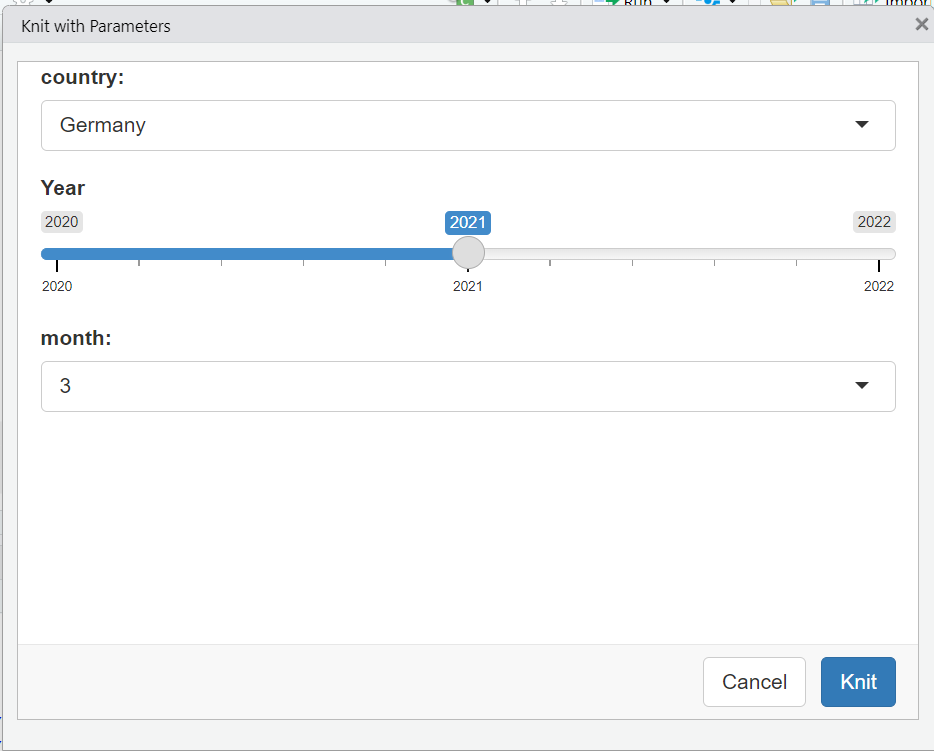
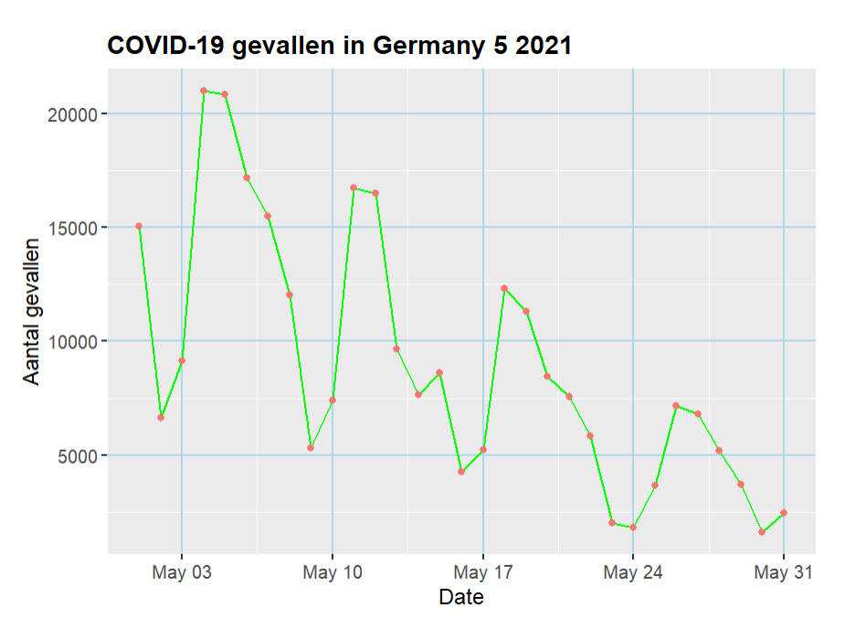

# Covid-19 report parametrizing in RMarkdown

```{r, include=FALSE}
knitr::opts_chunk$set(echo = TRUE)
```

## Introductie
Dit rapport biedt een analyse van COVID-19-gevallen en sterfgevallen voor een bepaald land en jaar. Het rapport is geparametriseerd om flexibiliteit mogelijk te maken bij het selecteren van het land, het jaar en de maanden waarin u geïnteresseerd bent.
De data is gedownload van European Center for Disease Control (ECDC).

De originele RMarkdown bestand waar de parameters ingesteld is bewaard in mijn portofolio repository [link naar repo](https://github.com/MarianaMousa1/MarianaPortofolio)

## load de data 
Eerst laden de benodigde libraries en de dataset.
```{r libraries en data, message=FALSE, error=FALSE, eval=FALSE}
# libraries
library(tidyverse)
library(lubridate)
library(ggplot2)
library(readr)
library(dplyr)
library(knitr)

 # Load the data
covid_data <- read.csv("doc/parameters_bestanden/data.csv")
colnames(covid_data)
head(covid_data)

# Convert dateRep to Date type
covid_data$dateRep <- dmy(covid_data$dateRep)

# Print the first few rows of the dataset
head(covid_data)

```

## Data filteren en gegevens voorbereiden
Filter de gegevens op basis van de parameters voor het opgegeven land, jaar en periode.

```{r filter, message=FALSE, error=FALSE, eval=FALSE}
# Access the parameters
country <- params$country
year <- params$year
months <- params$months

```

```{r, eval=FALSE}
# Filter data based on parameters
covid_filtered <- covid_data %>%
  filter(countriesAndTerritories == params$country & year == params$year & month %in% params$months)

head(covid_filtered)
```

```{r foto filter, error=FALSE}

cat("*Figure 1: COVID-19 Cases filter*") 
```


## Plotten maken voor COVID-19-gevallen en sterfgevallen.

```{r COVID-19-gevallen-plot, message=FALSE, error=FALSE, eval=FALSE}
# Plot COVID-19 cases
cases_plot <- ggplot(covid_filtered, aes(x = dateRep, y = cases)) +
  geom_line(color = "green") +
  geom_point(aes(color = "darkblue")) +
  labs(title = paste("COVID-19 gevallen in" , params$country , params$months , params$year , sep = " "),
       x = "Date",
       y = "Aantal gevallen") +
  theme(
    plot.title = element_text(size = 14, face = "bold"),
    axis.title = element_text(size = 12),
    axis.text = element_text(size = 10),
    panel.grid.major = element_line(color = "lightblue", size = 0.5)
  )
cases_plot

```

```{r foto cases, error=FALSE}
library(knitr)

cat("*Figure 1: COVID-19 Cases in Germany in maand mei 2021 *")
```

```{r COVID-19-sterfgevallen-plot, message=FALSE, error=FALSE, eval=FALSE}

# Plot for COVID-19 related deaths

sterfgevallen <- ggplot(covid_filtered, aes(x = dateRep, y = deaths)) +
  geom_line(color = "darkblue") +
  geom_point(color = "red") +
  labs(title = paste("COVID-19 sterfgevallen in" , params$country , params$months , params$year, sep = " "),
       x = "Date",
       y = "Aantal sterfgevallen") +
  theme_minimal()
 
sterfgevallen
  
```

```{r foto deathes, error=FALSE}
library(knitr)

cat("*Figure 1: COVID-19 sterfgevallen in Germany in maand mei 2021*")
```


## Dit is een beeld van de html bestand van de originele parameters rmarkdown bestand waarbij de county aangepast naar Netherlands, month 4 (april) en jaar 2022.

```{r, eval=FALSE}
webshot::install_phantomjs()
webshot::webshot("doc/parameters_bestanden/parameters1.html")
```


