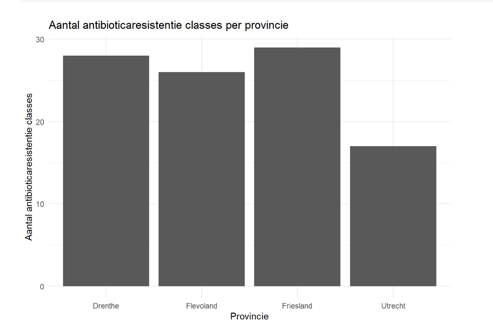

# Rpackage AMRNetherland

Om te demonstreren dat ik weet hoe ik een R-pakket kan bouwen, heb ik mijn eigen aangepaste pakket gemaakt met de naam AMRNetherland. Dit R-pakket biedt hulpmiddelen voor het analyseren en visualiseren van gegevens over antimicrobiële resistentie (AMR) in Nederland.

Dit pakket bevat functies om de prevalentie van resistentiegenen in procenten te berekenen, gegevens per stad en provincie te filteren en samen te vatten, en meer.

Het is ontworpen om onderzoekers en volksgezondheidsfunctionarissen te helpen gemakkelijk toegang te krijgen tot AMR-gegevens en deze te analyseren om trends te monitoren, patiëntgegevens te verkrijgen en de besluitvorming te informeren.

You can install the development version of AMRNetherland from [GitHub](https://github.com/) with:

```{r, eval=FALSE}
# install.packages("devtools")
devtools::install_github("MarianaMousa1/AMRNetherland")
```

```{r example1, message=FALSE, error=FALSE}
# Libraries loaden en data genereren
library(tidyverse)
library(AMRNetherland)

# Genereer een voorbeeld data frame
set.seed(123)  # Voor reproduceerbaarheid

# Aantal rijen in het data frame
n <- 100

# Lijst van provincies in Nederland
provinces <- c("Drenthe", "Flevoland", "Friesland", "Utrecht")

# Data frame genereren
amr_data <- tibble(
  institute_province = sample(provinces, n, replace = TRUE),
  n_classes_antibiotica = sample(1:10, n, replace = TRUE)
)

# Bekijk de eerste paar rijen van het data frame
head(amr_data)

```

functie plot_ab_resis toepassen

```{r,  message=FALSE, error=FALSE}
plot_ab_resis(amr_data)
```





